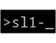

sl1cmd is a command line interface to interact with [ScienceLogic](https://sciencelogic.com/product/technologies/compute) Monitoring tool API.

# Table of Contents

- [Overview](#overview)
  - [Commands](#commands)
  - [Packages](#packages)
- [Installing](#intalling)
- [Getting Started](#getting-started)

# Overview

sl1cmd is a command line interface provides an interface to interact over daily tasks admonistrations using [ScienceLogic](https://sciencelogic.com/product/technologies/compute) Monitoring tool API.

## Commands

### Vault
- `vault` - create or update login information vault for api

### User Administration
- `id` - print users
- `userinfo` - print user information for the specified user
- `useradd` -  create a new user
- `userdel` - delete user account.
- `passwd` - change user password.

## Packages

- [cryptcfg](docs/pkg/cryptcfg.md) - Package cryptcfg crypt the config file used by sl1cmd.
- [httpcalls](docs/pkg/httpcalls.md) - Package httpcalls makes http request calls on sl1api.
- [sl1user](docs/pkg/sl1user.md) - Package sl1user have the routines for /api/account.
- [sl1generics](docs/pkg/sl1generics.md) - Package sl1generics have the generic routines to be used throughout the sl1cmd.

# Installing

tbd

# Getting Started

tbd

 

    

